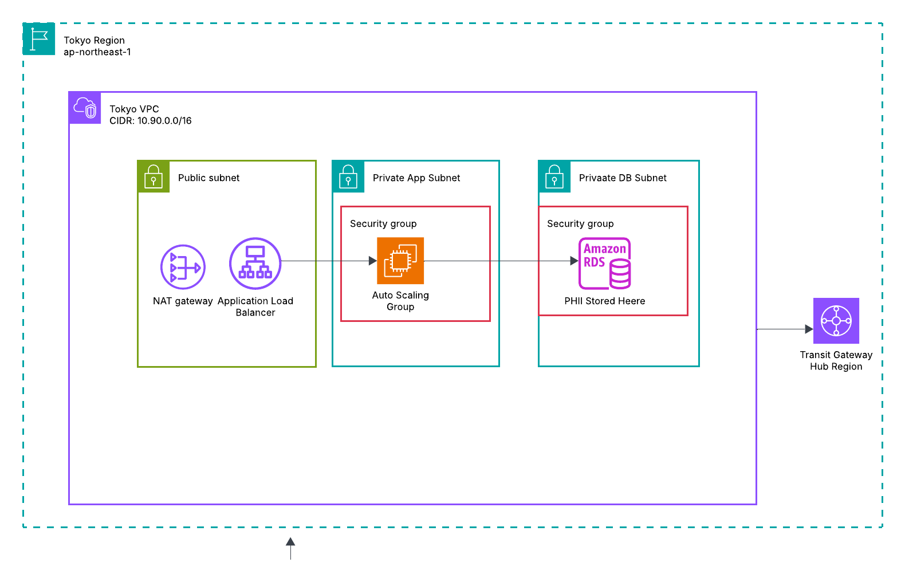
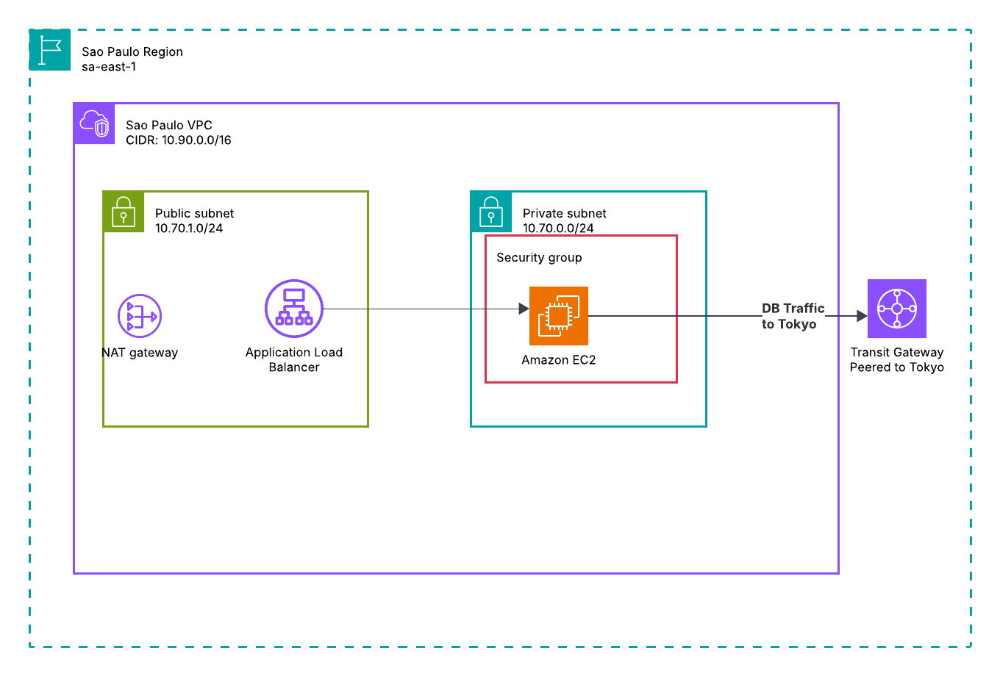
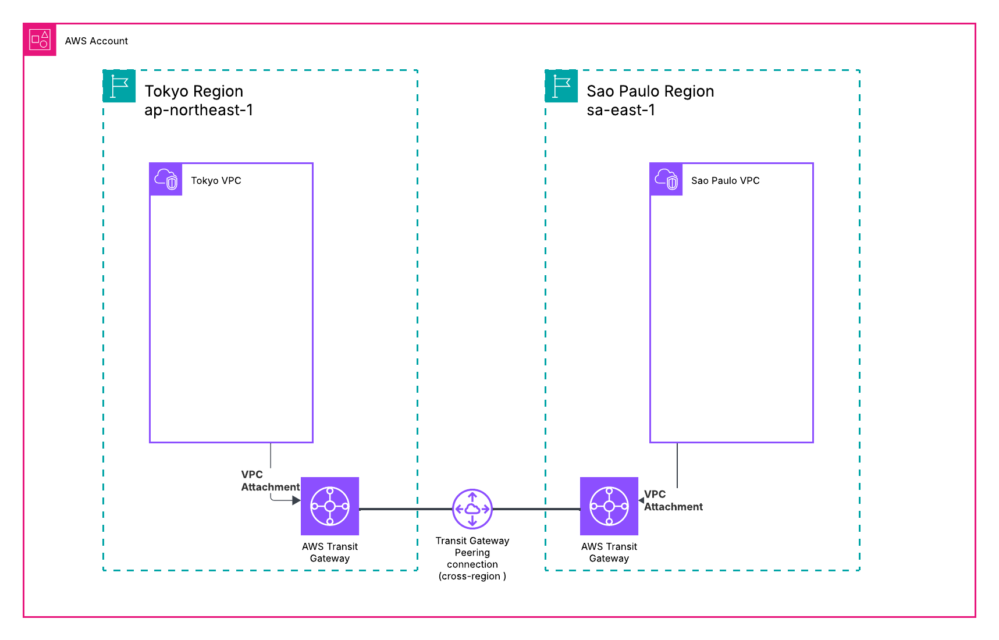

# Armageddon AWS Lab 3

## Technologies Used

- Amazon Web Services
- Terraform
- Python
- MySQL

## Lab Overview

🎯 Lab Objective
In this lab, you will design and deploy a cross-region medical application architecture that:
  Uses two AWS regions
    Tokyo (ap-northeast-1) — data authority
    São Paulo (sa-east-1) — compute extension
  Connects regions using AWS Transit Gateway
  Serves traffic through a single global URL
  Stores all patient medical data (PHI) only in Japan
  Allows doctors overseas to read/write records legally


## Global Infrastructure for Cloudfront

CloudFront serves as the single global entry point and is protected by AWS WAF. Traffic is routed to either the Tokyo or São Paulo Application Load Balancer based on cache behavior and origin configuration. No application servers or databases exist in the global layer.

## Tokyo Infrastructure

The Tokyo region architecture. The VPC contains public and private subnets, with the ALB in the public subnet and application servers and RDS deployed in private subnets. All patient medical data (PHI) is stored exclusively in Tokyo RDS. Connectivity to São Paulo occurs through a Transit Gateway attachment.

## Sao Paulo Infrastructure

The São Paulo compute-only region. The VPC contains public and private subnets with an ALB and Auto Scaling Group. No database resources are deployed in this region. All database traffic traverses the Transit Gateway peering to Tokyo, ensuring PHI remains stored exclusively in Japan.

## Transit Gateway

This lab builds on Labs 1 and 2 with a very important caveat...For this lab data can only exist in the Tokyo region. The Sao Paulo region can access data but is NOT allowed to persist any data. In order to satisfy this requirement, the RDS instance will only exist in the Tokyo region. In order for the instance in Sao Paulo to access data, we will configure a Transit Gateway (TGW). The TGW will allow the instance in the Sau Paulo region to connect to the RDS instance even though it lives in a private subnet in another region.

## Transit Gateway

Cross-region connectivity using Transit Gateway peering. Each region deploys its own Transit Gateway and attaches its VPC locally. The two Transit Gateways are connected via cross-region peering, allowing private encrypted database traffic to traverse the AWS backbone without exposure to the public internet.

To further increase security, we'll be making sure that access to the web application can only occur through CloudFront. We'll also use best practices like least privilege to ensure that instances do not have more access than they need.


## Why This Lab is Important for Cloud Engineers

Companies are required to comply with various laws such as GDPR, HIPPA...As a cloud engineer, you will be required to create architecture that is compliant with laws. This lab shows that you understand data residency and can build an architecture that complies with laws that restrict where data can live and how data can be accessed.

# Transit Gateway Peering Deployment
 
 Transit Gateway peering between Tokyo and São Paulo is created using a controlled three-step deployment process.

Because Transit Gateway is regional, each region must deploy its own TGW.
Peering must be initiated in one region and accepted in the other.

## Step 1: Deploy Tokyo (Without Accepting Peering)

```Bash

cd tokyo
terraform apply -var="enable_saopaulo_accept=false"
```

Once this is complete:

Tokyo TGW exists
No peering is attached yet(since Sao_Paulo hasn't been created yet).
This setsup Tokyo as the hub region.

## Step 2: Deploy São Paulo (Initiates Peering)

```bash

cd ../saopaulo
terraform apply
```

#### What this step does:

Creates TGW peering attachment:

from São Paulo

to Tokyo TGW

Creates VPC attachment to São Paulo TGW

## Step 3: Reapply Tokyo (Accept Peering + Add Routes)

```bash

cd ../tokyo
terraform apply -var="enable_saopaulo_accept=true"
```

#### What's done in this step is:
Accepts TGW peering attachment

Adds route in Tokyo TGW route table

Adds route to Tokyo private subnet route table

Enables cross-region traffic

### Why these steps are required:
Transit Gateway peering works like this:

One region creates the peering request

The other region must explicitly accept it

Routes must be added only after attachment exists

Terraform cannot create and accept the peering simultaneously across two independent state folders.